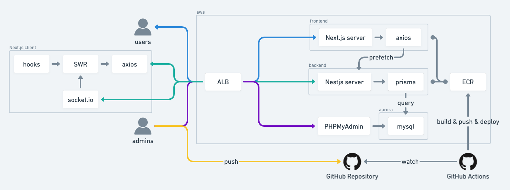

# アーキテクチャ

## 技術スタック

### フロントエンド

- [Next.js](https://nextjs.org/)
- [Tailwind CSS](https://tailwindcss.com/)
- [Emotion](https://emotion.sh/)
- [React-icons](https://react-icons.netlify.com/)
- [SWR](https://swr.vercel.app/)
- [Axios](https://axios-http.com/)

### バックエンド

- [NestJS](https://nestjs.com/)
- [Prisma](https://www.prisma.io/)

### インフラ

- [AWS](https://aws.amazon.com/)
- [Docker](https://www.docker.com/)

## ブランチ

- `master`: 作業中ではなく、完成形のコードの状態です
- `deploy/staging`: ステージング環境でのデプロイブランチです
- `deploy/production`: 本番環境でのデプロイブランチです
- `feature/*`: 開発用ブランチです

## ディレクトリ

- `.github`: GitHub Actions や、PR のテンプレートを保存するディレクトリ
- `.vscode`: Visual Studio Code の設定を保存するディレクトリ (※作業中)
- `.idea`: IntelliJ IDEA の設定を保存するディレクトリ
- `document`: コーディングに関するドキュメントを保存するディレクトリ
- `packages/frontend`: フロントエンドのソースコードを保存するディレクトリ
- `packages/backend`: バックエンドのソースコードを保存するディレクトリ
- `packages/infrastructure`: インフラのソースコードを保存するディレクトリ

## ネットワーク構成

