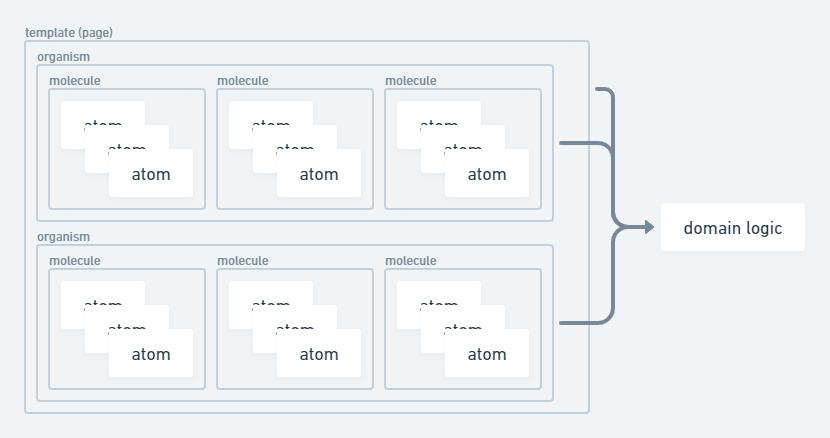

# コード規約

## 原則

- DRY 原則に従ってコードを書いてください。
- 基本的には linter の指示に従ってください。
- `eslint-disable-next-line` はなるべく使用しないようにし、どうしても使う場合は理由を明記してください。
- any を使わないでください。
  - 参考: https://qiita.com/uhyo/items/aae57ba0734e36ee846a

## ブランチ

- ブランチ名は `feature/` で始まるようにしてください。
- ブランチ名は snake_case で書くようにしてください。
- 修正する場合は `feature/fix_*` で、機能追加の場合は `feature/add_*` で始めるなど、subject から始めてください。

## コミット

- コミットは細分化してください。
- コミットメッセージは `feat: *` など、 subject から始めてください。
  - 参考: https://www.conventionalcommits.org/ja/v1.0.0/

## フロントエンド

基本的には tailwindcss を使ってください。  
animation 等、複雑になってきた場合は `@emotion/styled` を使ってください。

フロントエンドでは Atomic Design を採用しています。  
Atocomic Design とは、設計方法の一つで、コンポーネントを細かく分けて設計し、それらを組み合わせて複雑なページを作成するデザインパターンです。  
コンポーネントは、以下の 4 つに細分化でき、下に行けば行くほどコンポーネントの抽象度が下がります。

- Atoms
- Molecules
- Organisms
- Templates

下のコンポーネントは上のコンポーネントに依存することができますが、上のコンポーネントから下のコンポーネントを参照することはできません。

### Atoms

Atoms は、最小単位のコンポーネントです。  
例えば、ボタン、テキスト、画像などです。

### Molecules

Molecules とは、Atoms を組み合わせたコンポーネントです。  
例えば、ボタンとテキストを組み合わせたようなものがこれに該当しますが、再利用性を考えて設計する必要があります。  
また、Molecules まではサーバーとの通信や cookie へのアクセスなど、ドメイン知識を必要とするものを含めてはいけません。
これらは props で onClick などを渡すことで実現できます。

### Organisms

Organisms は、Molecules を組み合わせたコンポーネントです。  
例えば、ヘッダー、フッター、メインコンテンツなどです。  
しかし、ページ全体のレイアウトまでは知らず、Organisms を組み合わせることでページを作成します。

### Templates

Templates は、Organisms を組み合わせたレイアウトを司るコンポーネントです。  
例えば、トップページ、ログインページ、プロフィールページなどです。  
Next.js では、Templates は pages となり、今回の場合では、最も抽象度が低い"コンポーネント"は Organisms となります。

## バックエンド

### データベース

- テーブル名は複数形にしてください。
- テーブル名、カラム名は英小文字にしてください。
- テーブル名、カラム名は単語をアンダースコアで区切ってください。
- テーブル名、カラム名は意味のあるものにしてください。

### ルーティング

- REST 原則に従ってください。
- ルーティングは英小文字にしてください。
- ルーティングは単語をアンダースコアで区切ってください。
- ルーティングは意味のあるものにしてください。
